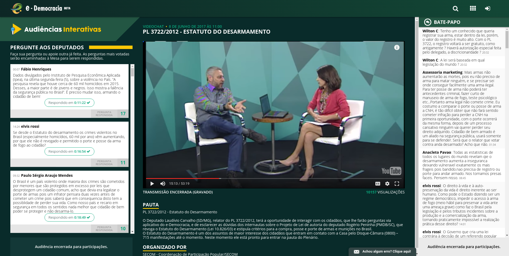

# O que são Audiências Interativas?

O objetivo das audiências públicas interativas é ampliar o alcance do debate das comissões promovendo interação com a sociedade. Por meio de vídeo-chat disponibilizado no Portal e-Democracia, qualquer cidadão tem a oportunidade de comentar, dar sugestões, fazer perguntas ou simplesmente assistir aos debates dos grandes temas nacionais realizados nas Comissões.

## Audiência Pública Interativa

Durante a discussão dos projetos de lei, as comissões temáticas da Câmara dos Deputados buscam cercar-se de informações úteis e qualificadas para a tomada de decisão. Um instrumento largamente utilizado para a consecução desse objetivo é a realização de audiências públicas, com especialistas no tema em questão.

Contudo, tendo em vista limitações físicas e de segurança, os plenários das comissões não comportam um grande número de pessoas. Além disso, ainda que o espaço físico não fosse limitante à participação popular nestes eventos, sabe-se que outros fatores dificultariam a presença de um maior número de pessoas, como o alto custo de deslocamento para e hospedagem em Brasília.

Por conta disso, o portal e-Democracia disponibiliza a ferramenta Audiência Pública Interativa, por meio da qual são transmitidas ao vivo as imagens e o áudio captados nos plenários das comissões, com a possibilidade de o cidadão acompanhar tudo o que ocorre na reunião. Além disso, os internautas podem ainda contribuir com perguntas e sugestões, que são lidas aos palestrantes pelo deputado que preside a reunião.

Com o objetivo de facilitar essa interação, a nova versão da ferramenta Audiência Pública Interativa promoveu a separação dos ambiente de chat –  em que os internautas podem conversar livremente sobre o tema em discussão –, do setor de perguntas, no qual o cidadão inclui um questionamento que pretende seja feito às autoridade presentes fisicamente à audiência pública. Com isso, evita-se a necessidade de um moderador acompanhar exaustivamente o fluxo participativo a fim de identificar eventuais questionamento para, daí então, comunicá-lo à autoridade inquirida.

Outra inovação dessa nova versão é o ranqueamento das perguntas feitas pelos cidadãos. Com isso, os próprios internautas podem votar nas perguntas por eles incluídas, organizando-as, eles próprios, por ordem de relevância.

Também com o intuído de facilitar a interação do usuário com a ferramenta, mas, nesse caso no que se refere ao histórico da discussão, incluíram-se links para as respostas das autoridades no vídeo. Na imagem abaixo, é possível perceber um botão com a frase “respondido em” logo abaixo de cada pergunta ranqueada pelos usuários. Clicando nele, é mostrado no vídeo gravado e disponibilizado na interface, o trecho exato em que é dada a resposta ao questionamento. A tela abaixo representa essa dinâmica:

