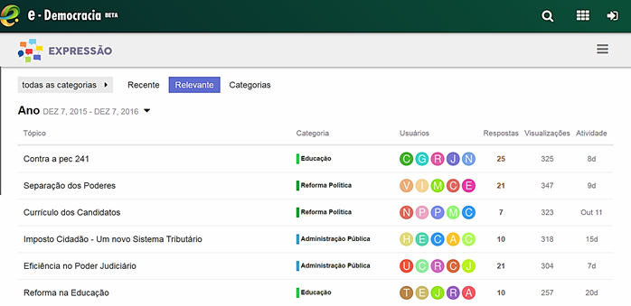
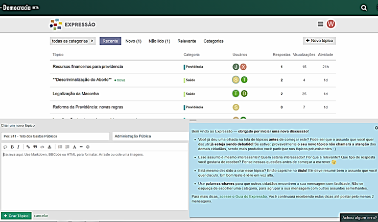
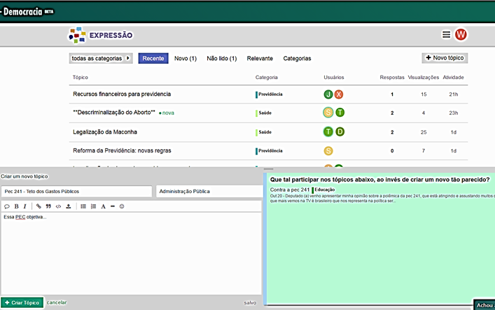
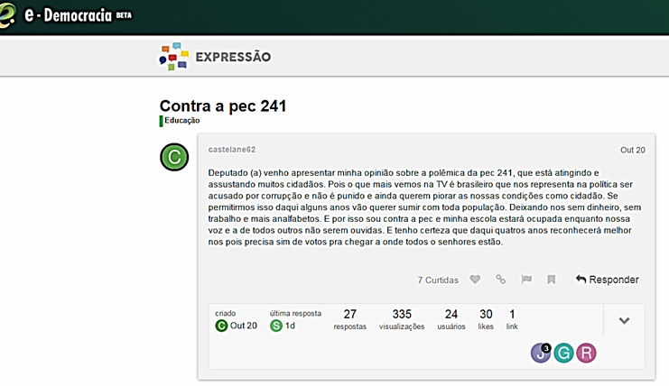

# O que é o Expressão?

No Expressão os cidadãos têm liberdade para criar novas discussões sobre quaisquer temas. Os deputados podem interagir nesses debates por escrito, postando suas opiniões, bem como através de vídeos. É preciso acompanhar as discussões a fim de divulgar as threads buscando atrair a participação de outros cidadãos e também dos demais deputados interessados na temática.

## Fóruns

Os fóruns virtuais de discussão funcionam de maneira assíncrona: a qualquer momento o cidadão pode acessá-los, assenhorar-se do que já foi debatido até então e contribuir com sua opinião, através de texto, áudio ou vídeo. 
Contudo, uma das principais dificuldades na construção de conhecimento em larga escala através de fóruns de debate online reside na dificuldade de controle sobre a pulverização da discussão. A chamada “fragmentação do debate” é promovida, principalmente, pelo comportamento dos usuários em criar vários tópicos de discussão com assuntos muito semelhantes, prática pode ser estimulada pelo design da ferramenta em que os fóruns virtuais estão ambientados . Essa questão assume especial relevância quando os temas debatidos se referem à agenda política e as discussões incluem as percepções de representantes eleitos pelos cidadãos , como é o caso do portal e-Democracia.

Ciente dessa problemática, o Laboratório Hacker da Câmara dos Deputados lançou no ano de 2016 uma nova modalidade de Fóruns, desenvolvida com base na plataforma Discourse , solução gratuita e de código aberto, customizada para as especificidades do portal e-Democracia. Dentre as principais inovações, destacam-se as que se relacionam com o objetivo de minimizar os efeitos da já mencionada pulverização da discussão virtual:

### Apresentação de tópicos de discussão segundo critérios de recenticidade e relevância

A nova plataforma de interações por meio de fóruns do portal e-Democracia, denominada Expressão, inaugura a possibilidade de apresentação dos tópicos de discussão segundo outros critérios além da mera classificação por categorias – única possibilidade da ferramenta que vinha sendo até então utilizada no portal. Conforme exemplificado na imagem abaixo, tornou-se possível ao usuário identificar tópicos de discussão recentemente criados e também aqueles em que a discussão está mais movimentada. Essas novas opções contribuem para mitigar a disfunção pela qual o usuário do fórum tende a recriar novos tópicos para discutir assunto já em debate, por não perceber a preexistência de discussões mais antigas sobre o tema que ele tem em mente.

### Orientações preliminares à criação de tópicos

A possibilidade de interagir com o usuário enquanto este se utiliza da plataforma é uma das principais inovações trazidas pelo Expressão. Ao iniciar o procedimento de criação de um novo tópico, é apresentada ao usuário uma tela com orientações para a formatação do novo espaço discursivo pleiteado. Algumas delas dizem respeito à utilização de linguagem adequada (gentil, não agressiva), técnicas para comunicar bem o assunto em mente (título, frase inicial) e também sobre a importância de evitar-se a dispersão da discussão. 
A primeira orientação dada pelo sistema é para que o usuário explore a lista de tópicos com o objetivo de averiguar se aquele tópico que se pretende criar não estaria já contemplado em alguma discussão preexiste. Na imagem a seguir, o quadro azul contém esse alerta:

### Sistema de notificação de semelhança com tópicos preexistentes

Outra funcionalidade do Expressão é a identificação de semelhança entre textos de tópicos preexistentes e daquele que está sendo criado pelo usuário. Essa análise ocorre em tempo real e notifica o usuário sobre a possível correspondência, convidando-o a participar da discussão naqueles ambientes em que o debate já está em andamento. A imagem abaixo demonstra a interação proativa do sistema, que se dá por meio de mensagens pré-programadas:

### Dados das mensagens e possibilidades de interações simples

Diante da narrativa participativa até aqui demonstrada, bem como tendo em vista a pujança do fluxo de interações ostentado pelo portal e-Democracia, o desenvolvimento da nova interface concebeu também possibilidades de interferências mais simples no debate por parte do usuário. 
Isso porque, após ser notificado da pré-existência de discussões semelhantes a que o gostaria de iniciar, o cidadão poderia sentir-se desestimulado a dar sua contribuição, uma vez percebendo que sua opinião estaria contemplada naquilo que já houvesse sido escrito por outros participantes. 

Desta forma, acrescentou-se para o internauta as possibilidades de “curtir”, “favoritar” e compartilhar os tópicos de discussão nas mídias sociais, inaugurando novas modalidades de interação com o conteúdo.  Esse tipo de interação contribui também para a ampliação da visibilidade do debate, fortalecendo-o ao invés de enfraquecê-lo, em contraposição à dinâmica observada na versão anterior do sistema, responsável pela dispersão das discussões virtuais do portal e-Democracia . Essas inovações estão representadas na imagem a seguir:

