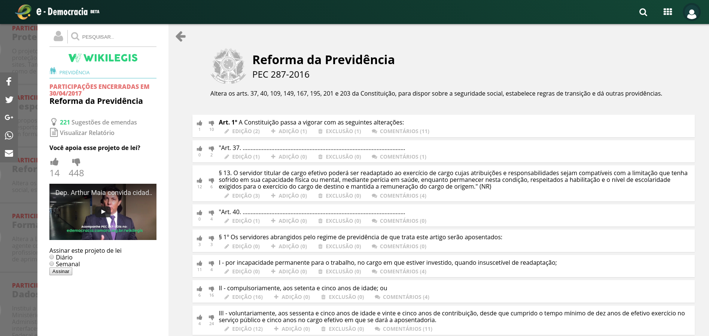

# O que é Wikilegis?

As discussões ambientadas no portal e-Democracia costumam relacionar-se com algum projeto de lei em tramitação na Câmara dos Deputados. Assim, se for interesse do relator da matéria ou do Presidente da comissão temática, é possível a publicação da proposição no Wikilegis, que funciona como um editor de textos colaborativo para projetos de lei.

Por meio dessa ferramenta, o cidadão pode contribuir com suas opiniões em cada artigo da proposição, com a possibilidade de sugerir uma nova redação ao dispositivo legal por ele analisado.

As manifestações são então analisadas por consultores legislativos, a fim de serem observadas as regras de técnica legislativa pertinentes, e, em seguida, passam pelo crivo político do relator do projeto de lei, que decidirá acerca da conveniência e oportunidade da incorporação das sugestões ao texto final da proposição. A tela a seguir apresenta a interface do Wikilegis:

Além de um design mais fluido e atraente, o novo Wikilegis permite a inclusão de vídeos explicativos, por meio dos quais os Deputados relatores da matéria convidam à participação e descrevem os principais pontos do projeto de lei. Outra novidade é a integração com o sistema de tramitação das proposições legislativas da Câmara dos Deputados (SILEG), que incorpora na página do projeto de lei no Wikilegis informações sobre as fases do processo legislativo em que a proposição se encontra. Na imagem acima, por exemplo, informa-se que a análise da proposição está a cargo da CPD (Comissão de Defesa dos Direitos das Pessoas com Deficiência), aguardando parecer.

A propagação dos conteúdos do Wikilegis também recebeu especial atenção nessa nova versão da ferramenta, com a possibilidade de compartilhamento nas mídias sociais e a função “incorporar”, que gera um código utilizado para o embed do projeto em sites, blogs e outros espaços digitais, oportunidades fundamentais para a ampliação do alcance da consulta pública. Vale ressaltar que, embora espalhada pela internet através desses mecanismos, toda a participação relacionada ao projeto alimenta o sistema do Wikilegis no portal e-Democracia, sendo por ele devidamente computada.